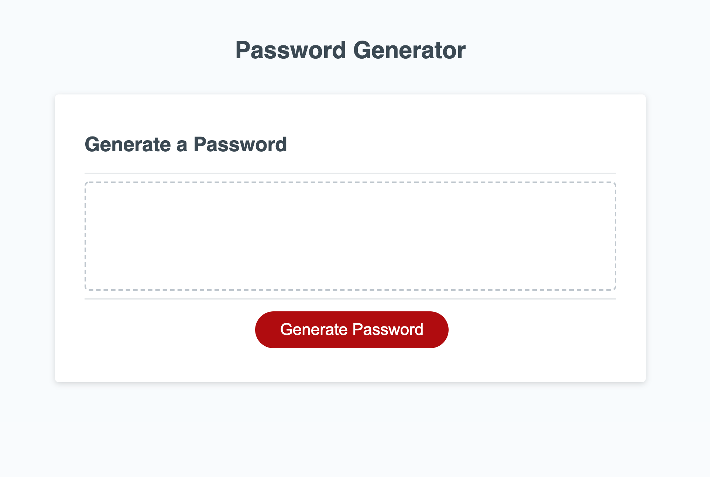
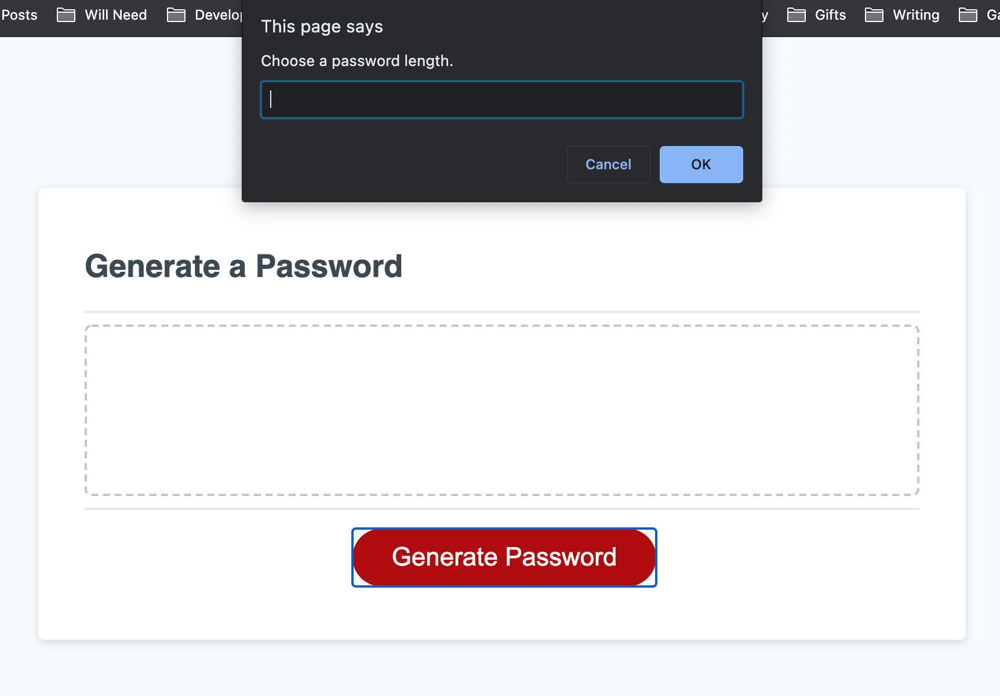
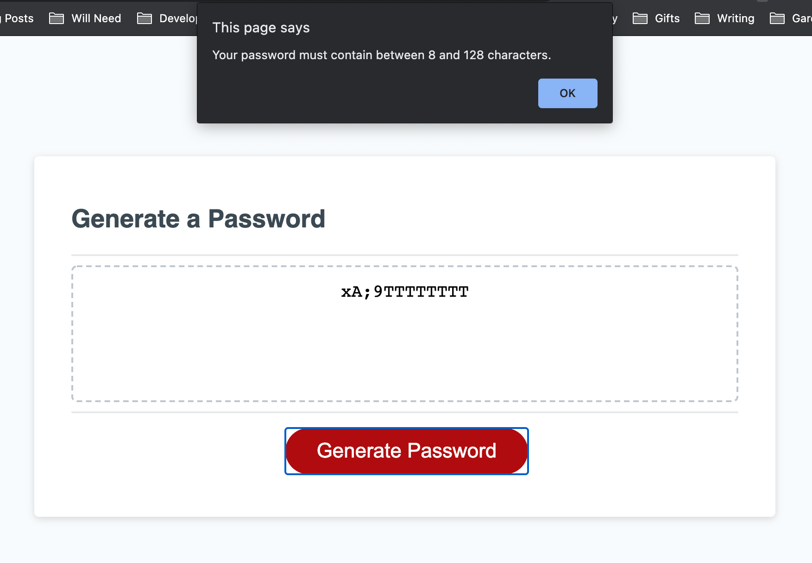
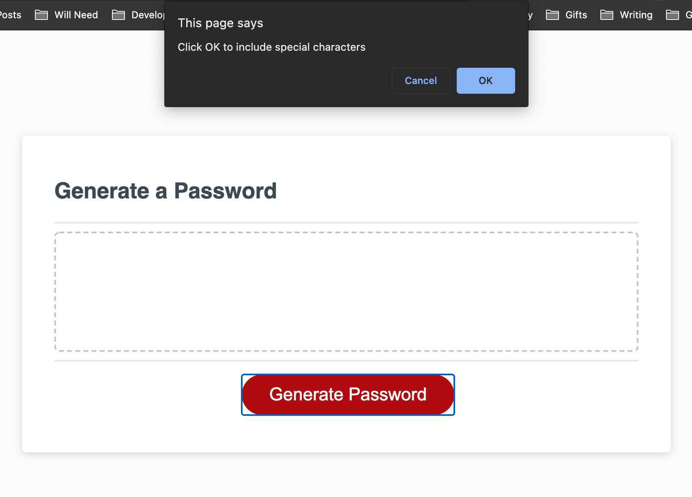
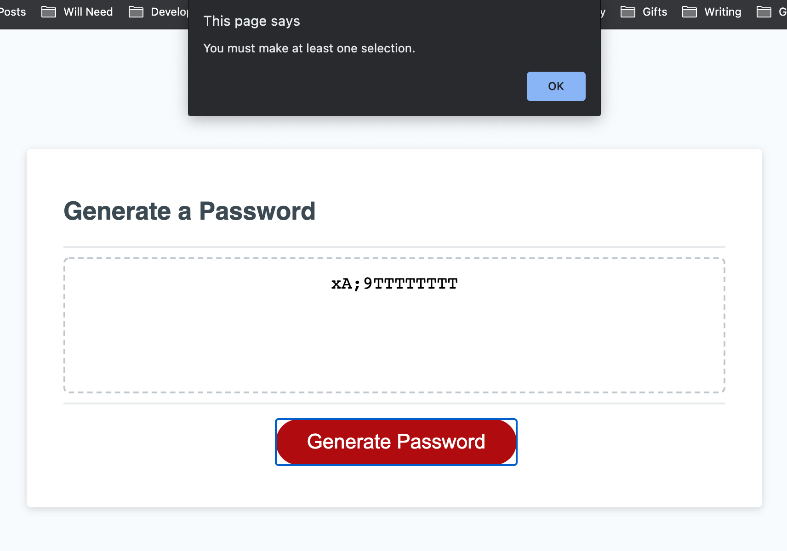

# Homework 3: JavaScript Password Generator
This repository holds our third homework assignment, a refactoring of the code for a password generator website. I refactored code in the HTML file and wrote the code in the Javascript file.

## Screenshots

## Credits

- [UNC-Chapel Hill Coding Bootcamp](https://bootcamp.unc.edu/)
